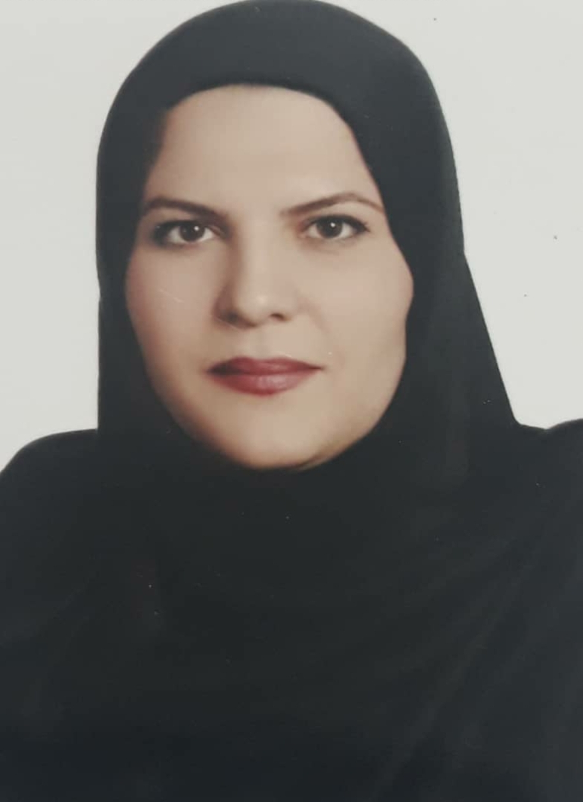

### About Me

### Personal Information

- First Name: Helen
- Last Name: Dabbaghi Boukani
- Birth Date: 1974/August/23
- Marriage Status: Married

### Skills
 
- Proficient and familiar  with World-Class Customer Service, Troubleshooting / Problem Solving, Sales Support, Technical and User Support, 

- Complaint Handling, Report and Documentation , Customer Order Fulfillment, importing and exporting procedure of cargos, foreign 

- correspondence, custom clearances, import and export rules, Master in interpreting & translating of commercial, computer

- industrial ,shipping ,educational & tourism fields, Master in searching in Internet  for any information. 

### Languages

- Persian(Nativ)

- English(GOOD)

### Honors

- Marketing & Advertising Certificate ( No.:84/8706)                                                    
From Business Training Center Affiliated to Institute for Trade Studies and Research (Ministry of Commerce) - (2006) 
 
- Container Transportation Certificate ( No.:82/212/00010)                      
Issued by IRISL Maritime Training Institute (2006) 
 
- Web Designer Certificate       
[HTML  / FrontPage / Flash/ Dream Weaver (2001)] 
Medical Emergency Certificate ( No.:9419 – 1996 ) 

- Management Science Educational of Computer  &  
Teaching Certificate in Internet  (No.: 5-8/1346 &  5-8/1347 – 2006) 
- Typing of computer Certificate  &  Zarnegar Course Certificate  
      ( No.:7139 & 8254) - Issued by Iran
Technical Educational Center(1998) 

### Working Experience

- International shipping and shipping  From September 1999 to August 2009 

- Has twenty years of experience in shipping and international shipping companies on the right Different types (manager of import, export, marketing, transit, operations and follow-up) - from 1999 to 2017 

- Management and coaching (teaching) in free computer schools

### Education

- IRU Diploma  Certificate   
From I.C.C.I.M Education and Inst.  
2-years–Specialized Diploma in Freight

- Forwarding Management ( FIATA Diploma)  
From International Federation of Freight Forwarders Associations ( Int. code : 6656)  
- Associate Diploma in Applied Computer Science   
From Azad University –Mobarakeh/Isfahan Branch  

### Certificate

-  ICDL certificate issued by the Technical and Professional Organization of Iran Evidence of international road 

- transport of Euro goods Issued by the 

- Educational and Research Institute of the Iranian Chamber of Commerce, 

- Industries and Mines Issued by the Swiss Technical and Vocational School with International Code Number: 6656- (2007-2008) - Certificate of Container 

- Transport Issued by the Shipping 

- Training Institute of the Islamic Republic of Iran Certificate in Marketing and Advertising Issued by the Business Education Center affiliated with the Institute of Business Studies and Research (Ministry of Commerce) 

- Container transport certificate Issued by the Shipping Training Institute of the Islamic Republic of Iran Certificate of web page design including programming 

- Certificate of Medical Emergency and Relief issued by Jihad University and Tehran Medical Sciences Branch - 

- Management and coaching credentials of a free technical and vocational school in the field of Internet

### Other Accounts

- instagram: <a href="https://instagram.com/sea_sun238?igshid=1qyzfivqknjm9">https://instagram.com/sea_sun238?igshid=1qyzfivqknjm9</a>

- Email: <a href="seasun238@gmail.com">seasun238@gmail.com</a>
 
 >Assessment

+ [Resume and cover letter](https://github.com/seasun238/PNU_3991_AR/blob/main/XX_CV_CheckList_AR_3991.pdf)

+ [Public Sector Evaluation Summary](https://github.com/seasun238/PNU_3991_AR/blob/main/XX_GeneralSection_CheckList_AR_3991.pdf)

 
 ----------
  Persian Resume: <a href="https://seasun238.github.io/resume-fa/"> Resume </a>
